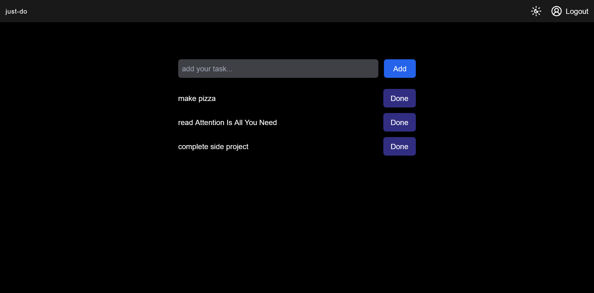

# just-do
a open source to-do without distracted stuffs



## tech stack
- [Next.js](https://nextjs.org/)
- [Supabase](https://supabase.com/)  
- [Lucide](https://lucide.dev/) 
- [Vercel](https://vercel.com) 

## how to run?

then install all dependencies

```bash
npm install
```

and 
```bash
npm run dev
```
for db & auth you have to setup supabase project